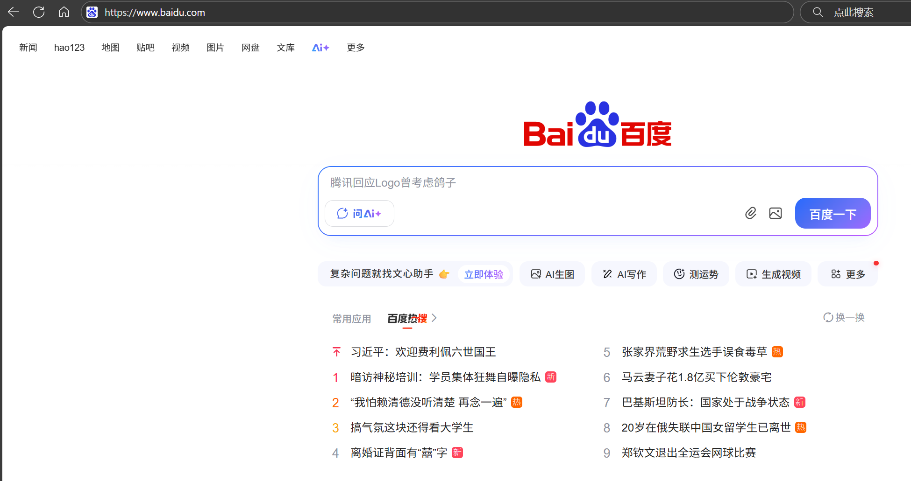

# 网络数据封装传输过程
我们在百度中输入一个网址，百度的服务器就给我们返回了这么一个页面

这是怎么做到的呢？
## 数据封装过程

*图左为百度服务器，图右（主机A）为用户主机*

1.如上图所示，在浏览器中输入网址（应用层）后，应用层就开始往下传输。

2.传输到传输层后，传输层为其分装一个tcp头部
(https协议就是基于tcp协议的)并提供端口。端口是为了主机A把数据发到百度服务器的时候，百度服务器能够判断出应该用哪个应用程序进行处理(https协议的默认端口是443)

3.接着传到网络层，网络层为其分装一个ip头部。ip头部包含了源IP与目的IP，能帮助路由寻址（可能还有dns域名解析）

